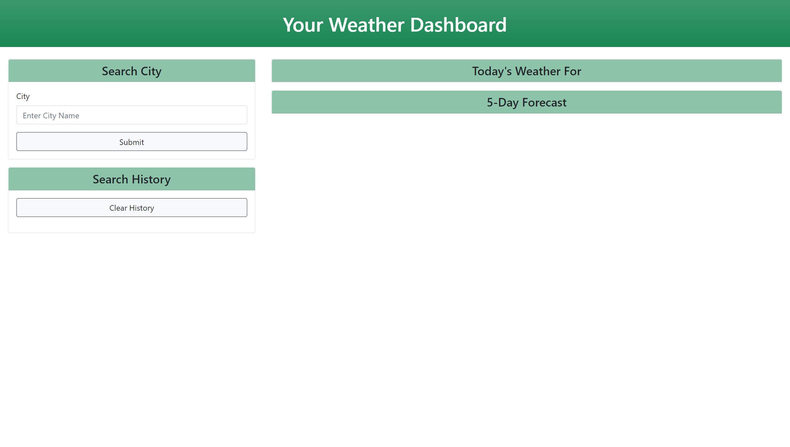

# Weather Dashboard

## Table of Contents
1. [Description](#description)
2. [Challenges](#challenges)
3. [Screenshots](#screenshots)
4. [Technologies Used](#technologies-used)
5. [Future Development](#future-development)
6. [Contributors](#contributors)
7. [Links](#links)

## Description
The weather dashboard is an application created to give the user current and future weather data based off of their searched city.

## Challenges
My biggest challenge was towards the end of the project when I was creating the 'futureForecast()`. I had an issue with findng the right place to call the function but once that was figured out, finishing off that function to get the data on the page dynamically was no problem!

Currently, my challenge is understanding how I lost code that I wrote to correct nearly all errors that were presented upon deployment. I will be working at correcting these issues once again for a fully funcitoning application without errors.

## Screenshots
Here's a screenshot of the main page of this application!

## Technologies Used
* HTML
* CSS
* JavaScript

## Future Development
* Add more animation for better an enhanced user experience
* Use a different API that also has weather animation
* Update the styling to give a "wow" factor when using the application

## Contributors
I'm proud to say that I was the sole contributor of this application

# Links
* **[Repository](https://github.com/maggiejoe/weather-dashboard.git)**
* **[Live App](https://maggiejoe.github.io/weather-dashboard/)**

